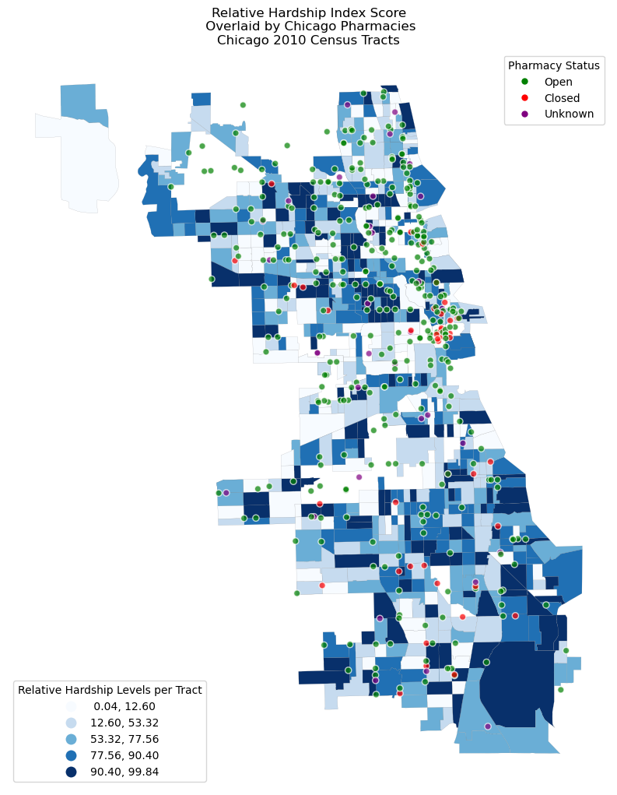

<<<<<<< HEAD


```{python echo=False}
# load packages
import geopandas as gpd
import pandas as pd
from pathlib import Path
from shapely import wkt
import matplotlib.pyplot as plt
import altair as alt
import streamlit as st
from matplotlib.patches import Patch
import matplotlib.lines as mlines
import os
```


```{python echo=False}
project_dir = Path.cwd().parent
data_dir = project_dir / "data" / "raw-data"

census_2010 = data_dir / "CensusTractsTIGER2010_20260303.geojson"

census_2010_gdf = gpd.read_file(census_2010)
```


```{python echo=False}
project_dir = Path.cwd().parent
data_dir = project_dir / "data" / "raw-data"

pharmacy = data_dir / "Pharmacy_Status_-_Historical_20260302.csv"

df_pharm = pd.read_csv(pharmacy)
```

```{python echo=False}
# make pharmacy names capitalized
df_pharm['Pharmacy Name'] = df_pharm['Pharmacy Name'].str.capitalize()

# create mapping for pharmacy status
mapping = {
    'OPEN':'Open',
    'CLOSED': 'Closed',
    'Permanently closed': 'Closed',
    'closed': 'Closed',
    'open': 'Open',
    'permanently closed': 'Closed',
    'unknown': 'Unknown'
}

# recode the status column
df_pharm['Status'] = df_pharm['Status'].replace(mapping)
```

```{python echo=False}
# load pharmacies as a geodataframe

# drop nas
df_pharm = df_pharm.dropna(subset=['New Georeferenced Column'])

# drop na strings
df_pharm = df_pharm[
    df_pharm['New Georeferenced Column']
    .str.lower()
    .ne('nan')
]

# convert wkt to a geometry
df_pharm['geometry'] = gpd.GeoSeries.from_wkt(
    df_pharm['New Georeferenced Column'],
    on_invalid='ignore'
)

# drop failed parses
df_pharm = df_pharm.dropna(subset=['geometry'])

# create geodataframe
pharm_gdf = gpd.GeoDataFrame(
    df_pharm,
    geometry='geometry',
    crs='EPSG:4326'
)
```

```{python echo=False}
# map colors to pharmacy status

# create color dictionary
color_dict = {
    'Open': 'green',
    'Closed': 'red',
    'Unknown': 'purple'
}

# map colors to gdf
pharm_gdf['color'] = pharm_gdf['Status'].map(color_dict)
```

```{python echo=False}
# join pharmacy location and census tract gdfs (pharmacy emphasis)
combined1_gdf = gpd.sjoin(pharm_gdf, census_2010_gdf, 
    how='left',
    predicate='within')
```

```{python echo=False}
# other sjoin option

# join gdfs (alternative merge with more census data and less pharm data)
combined2_gdf = gpd.sjoin(census_2010_gdf, pharm_gdf, 
    how='left',
    predicate='intersects')

#rename geo id column to merge with cha later
combined2_gdf = combined2_gdf.rename(columns={'geoid10':'GEOID'})
```

```{python echo=False}
# load cha data
cha_datapath = data_dir / "Chicago Health Atlas Data Download - Census Tracts.csv"

cha = pd.read_csv(cha_datapath)
```

```{python echo=False}
# remove first 3 rows, which have data definitions, citations, etc.
cha = cha.iloc[4:809]

# source: https://geopandas.org/en/stable/gallery/create_geopandas_from_pandas.html
cha_gdf = gpd.GeoDataFrame(
    cha, geometry=gpd.points_from_xy(cha.Longitude, cha.Latitude), crs="EPSG:4326"
)

# rename combined_gdf1 column for spatial joining purposes
combined1_gdf.rename(columns={'geoid10':'GEOID'}, inplace=True)

# merge cha and pharmacy/tract data
cha_pharm = combined2_gdf.merge(cha_gdf, on='GEOID')

# recode geoid for census data
census_2010_gdf.rename(columns={'geoid10':'GEOID'}, inplace=True)

# merge cha and tract only data
cha_tract = census_2010_gdf.merge(cha_gdf, on='GEOID')

# define geometry column for plotting later
cha_pharm = cha_pharm.set_geometry('geometry_y')


# set as geometry for future chloropleth maps
cha_pharm = cha_pharm.set_geometry('geometry_x')
```

```{python echo=False}
# group data by census tract
pharm_by_tract = (
    combined1_gdf
    .groupby('GEOID')
    .size()
    .reset_index(name='pharmacy_count')
)

# count pharmacies per tract
pharm_counts = (
    combined1_gdf
    .groupby('tractce10')
    .size()
    .reset_index(name='pharmacy_count')
)

# merge counts back to census polygons
census_and_pharm_gdf = census_2010_gdf.merge(
    pharm_counts,
    on='tractce10',
    how='left'
)

# fill missing tracts with zero pharmacies
census_and_pharm_gdf['pharmacy_count'] = (
    census_and_pharm_gdf['pharmacy_count']
    .fillna(0)
)

# project to crs in meters
census_and_pharm_gdf = census_and_pharm_gdf.to_crs(epsg=26916)

# calculate area in square miles
census_and_pharm_gdf['area_sq_miles'] = (
    census_and_pharm_gdf.geometry.area / 2_589_988
)

# compute density
census_and_pharm_gdf['pharm_density'] = (
    census_and_pharm_gdf['pharmacy_count'] /
    census_and_pharm_gdf['area_sq_miles']
)
```

This writeup aims to provide additional information and context for the associated data project, “Socioeconomic Distributions and Pharmacies in Chicago”. The project utilizes public health and pharmacy data to explore the relationships between pharmacy access and socioeconomic status. Our research is founded on the question of whether there is a relationship between pharmacy access and socioeconomic status (race, income, etc.) in the City of Chicago. The following sections of this text address the policy implications of our research questions, data collection, data analysis and coding, data visualizations, and our findings. 
Our research questions have significant implications on the advancement of socioeconomic equity and health outcomes in the city of Chicago. Firstly, it is well established in the literature that low pharmacy access is significantly correlated with majority non-white populations, presence of a disability, low education, and other socioeconomic factors (Wittenhauer et al. 2024). These low-access communities are at greater risk of health problems due to difficulty in accessing prescriptions. This is of particular concern for the City of Chicago, which is highly segregated by race, income, and health outcomes (Smith et al. 2021). Thus, our research aims to identify regions that may benefit from increased pharmacy access, whether that be through a new pharmacy opening, pharmacy shuttles, or otherwise. With more information on pharmacy access and need across the City of Chicago, policymakers would be better equipped to help underserved communities improve public health.
We utilized four datasets to address our questions regarding health, socioeconomic status, and pharmacy access. The first two datasets are from the Chicago Data Center. The first, linked here, provides data on the geographical boundaries of Chicago’s census tracts and was used to (1) create a map of Chicago’s census tracts and (2) attribute pharmacy locations to their corresponding census tract. The second dataset (link) is titled “Pharmacy Status Map - Historical” and provided our geographic data for Chicago pharmacies; this dataset also included the status (opened, closed, or unknown) of each pharmacy. A significant limitation from this dataset is that it seems to be missing a substantial number of pharmacy locations, although it is unclear if there is a specific type of pharmacy that was more likely to be left out than others. Lastly, we utilized data from the Chicago Health Atlas (link), which provided data on income, walkability, transportation access, and other socioeconomic variables–all aggregated by census tract. This dataset lacked substantial health data at the census tract level, forcing us to focus on socioeconomic disparities as opposed to health disparities. 
Data cleaning involved converting certain variables into geospatial or numeric data, as appropriate, in addition to formatting processes that standardized our data. Firstly, we loaded in the pharmacy location data, made all of the pharmacy names a string with the first letter capitalized, and recoded the pharmacy status variable such that it only included “Open”, “Closed”, and “Unknown”. Previously, status values varied by capitalization and included “closed” and “permanently closed”, which we treated as equal. The census tract boundary data was loaded as a geodataframe using the geopandas library, and required no additional cleaning other than renaming the “geoid10” column (“GEOID” is the ID number assigned to each census tract) in order to merge it with the other datasets. After loading in the raw Chicago Health Atlas data, we had to remove the first three columns, which included variable definitions and citations. Finally, the pharmacy location data and census boundary data were merged via a spatial join (each pharmacy was assigned a census tract) and the socioeconomic data from Chicago Health Atlas was merged based on the “GEOID” column. The data processing code is available in preprocessing.py. 
The Relative Hardship Index Score plot (hardship_pharm.png) displays a choropleth (color-coded map) of Chicago census tracts, populated by the relative hardship scores compared to other census tracts. The Hardship Index is a composite score reflecting hardship in the community that allows for comparison across geographies. Darker colors represent higher levels of hardship. The distribution of pharmacies in Chicago is laid over the hardship choropleth. We created this plot using matplotlib. It suggests that areas with lower levels of hardship tend to have fewer pharmacies, but the distribution could be a result of lower populations in lower hardship tracts. 


```{python echo=False}
#make hardship values numeric
cha_pharm['HDX_2020-2024'] = pd.to_numeric(cha['HDX_2020-2024'], downcast=None)

# make choropleth map for CHA hardship index
fig, ax = plt.subplots(figsize=(10,10))

# plot hardship choropleth
cha_pharm.plot(
    column='HDX_2020-2024',
    cmap='Blues',
    scheme='quantiles',
    k=5,
    legend=True,
    linewidth=0.1,
    edgecolor='grey',
    ax=ax
)

# save the choropleth legend
choropleth_legend = ax.get_legend()
choropleth_legend.set_title("Relative Hardship Levels per Tract")
choropleth_legend.set_loc('lower left')

# plot pharmacy distribution
pharm_gdf.plot(
    ax=ax,
    color=pharm_gdf['color'],
    markersize=35,
    alpha=0.7,
    legend='status',
    edgecolor='white'
)

# create custom legend labels
open_handle = mlines.Line2D([], [], color='green', marker='o', linestyle='None', markersize=5, label='Open')
closed_handle = mlines.Line2D([], [], color='red', marker='o', linestyle='None', markersize=5, label='Closed')
unknown_handle = mlines.Line2D([], [], color='purple', marker='o', linestyle='None', markersize=5, label='Unknown')

# add pharmacy legend
pharm_legend = ax.legend(
    handles=[open_handle, closed_handle, unknown_handle],
    title='Pharmacy Status',
    loc='upper right'
)

# add the first legend back
ax.add_artist(choropleth_legend)

# additional settings
plt.tight_layout()
ax.set_title('Relative Hardship Index Score\n Overlaid by Chicago Pharmacies\nChicago 2010 Census Tracts')
ax.axis('off')
ax.set_axis_off()

plt.show()
```

The Per Capita Income per Chicago Census Tract plot (inc_pharm.png) displays a choropleth of per capita income of each Chicago census tract. Darker colors represent higher levels of per capita income. The distribution of Chicago pharmacies is laid over the choropleth. The plot was created using matplotlib. It suggests that there is a correlation between census tract income and pharmacy presence, with higher tract income being associated with higher numbers of pharmacies. 

```{python}
# plot per capita income and pharmacy density

# change per capita income variable from float to integer
cha_pharm['PCI_2020-2024'] = pd.to_numeric(cha_pharm['PCI_2020-2024'], downcast=None)

# make choropleth map (per capita income per census tract)
fig, ax = plt.subplots(figsize=(10,10))

# plot per capita income
cha_pharm.plot(
    column='PCI_2020-2024',
    cmap='Blues',
    scheme='quantiles',
    k=5,
    legend=True,
    linewidth=0.1,
    edgecolor='grey',
    ax=ax
)

# save the choropleth legend
choropleth_legend = ax.get_legend()
choropleth_legend.set_title('Per Capita Income')
choropleth_legend.set_loc('lower left')

# plot pharmacies
pharm_gdf.plot(
    ax=ax,
    color=pharm_gdf['color'],
    markersize=35,
    alpha=0.7,
    legend='status',
    edgecolor='white'
)

# create custom legend labels
open_handle = mlines.Line2D([], [], color='green', marker='o', linestyle='None', markersize=5, label='Open')
closed_handle = mlines.Line2D([], [], color='red', marker='o', linestyle='None', markersize=5, label='Closed')
unknown_handle = mlines.Line2D([], [], color='purple', marker='o', linestyle='None', markersize=5, label='Unknown')

# add pharmacy legend
pharm_legend = ax.legend(
    handles=[open_handle, closed_handle, unknown_handle],
    title='Pharmacy Status',
    loc='upper right'
)

# add the first legend back
ax.add_artist(choropleth_legend)


ax.set_title('Per Capita Income per Chicago Census Tract\nWith Pharmacy Distribution\nChicago 2010 Census Tracts')
ax.axis('off')
plt.tight_layout()

plt.savefig('inc_pharm.png', bbox_inches='tight')


plt.show()
```

The Pharmacy Density per Square Mile plot (pharm_dens_sqmi.png) displays a choropleth of the number of pharmacies per square mile for each Chicago census tract. Darker colors represent higher levels of pharmacies per square mile. The plot was created in matplotlib. The plot indicates that there are more pharmacies per tract square mile in the north and west sides compared to the south side. Traditionally, the north, west, and south sides of Chicago have distinctly different racial populations with the north side composed of a mostly white population while racial minorities compose the majority of the population in the west and south sides. This trend suggests that racial minorities in the south side lack access to a disproportionate number of pharmacies compared to populations in the north and west side.

```{python}
# make choropleth map (pharm density per square mile)
fig, ax = plt.subplots(figsize=(10,10))

census_and_pharm_gdf.plot(
    column='pharm_density',
    cmap='OrRd',
    scheme='quantiles',
    k=5,
    legend=True,
    linewidth=0.1,
    edgecolor='grey',
    ax=ax
)

# add legend title
leg = ax.get_legend()
leg.set_title("Pharmacies per Square Mile")
leg.set_loc('lower left')

ax.set_title('Pharmacy Density per Square Mile\nChicago 2010 Census Tracts')
ax.axis('off')
plt.tight_layout()

plt.savefig('pharm_dens_sqmi.png', bbox_inches='tight')

plt.show()
```

The Chicago Pharmacy Distribution plot (pharm_dist.png) displays the presence of pharmacies across Chicago colored by their operational status (open, closed, or unknown). The plot is created in matplotlib. The distribution of pharmacies is higher in the north side of Chicago compared to the west and south sides. The presence of closed pharmacies is highest in the Loop and in the south side. This indicates that the north side, which is wealthier and composed of higher levels of white people compared to other parts of Chicago, has increased access to pharmacies compared to other areas of Chicago.

```{python}
# set up plot (Chicago Pharmacy Distribution on census map)
fig, ax = plt.subplots(figsize=(8,6))

# plot chicago in blue
census_2010_gdf.plot(ax=ax, color='lightblue', alpha=0.5)

# plot pharmacies
pharm_gdf.plot(
    ax=ax,
    color=pharm_gdf['color'],
    markersize=5,
    alpha=0.7
)

# create legend handles
legend_handles = [
    Patch(facecolor=color, edgecolor='black', label=status)
    for status, color in color_dict.items()
] 

# add legend
ax.legend(
    handles=legend_handles,
    title='Pharmacy Status',
    loc='lower left',
    frameon=True
)

plt.title('Chicago Pharmacy Distribution')
plt.tight_layout()

ax.set_axis_off()

plt.savefig('pharm_dist.png', bbox_inches='tight')

plt.show()
```

The Most Common Pharmacies in Chicago barplot (pharm_type.png) displays the distribution of Chicago pharmacy types. The plot was created using Altair. Most pharmacies in Chicago are independently owned, with the second most common being those operated by Walgreens. There is a large drop between the first and second most common pharmacy types compared to all others. The distribution suggests that local pharmacies are able to effectively serve their community and remain in business.  

```{python}
# move index into a column so altair can read it
pharm_grouped = df_pharm.groupby('Pharmacy Name').size().reset_index(name='Num Pharmacies')

# make a plot of common pharmacies
bars = alt.Chart(pharm_grouped).mark_bar().encode(
    x=alt.X('Num Pharmacies:Q', title='Pharmacy Total'),
    y=alt.Y('Pharmacy Name:N', title='Pharmacy Name', sort='-x')
).properties(
        width=400, 
        height=200 
)

text = bars.mark_text(\
    align='left',
    baseline='middle',
    dx=3
).encode(
    text='Num Pharmacies:Q'
)

chart = (bars + text).properties(
    title='Most Common Pharmacies in Chicago'
).configure_axis(
    labelFontSize=6,
    labelLimit=400
)

chart
```

The Pharmacy Density per 1000 Residents plot (residents_pharm.png) displays the distribution of pharmacies per 1000 residents for each Chicago census tract. Darker colors represent higher densities of residents per each tract. The plot was created using matplot lib. The plot indicates that the proportion of pharmacies to residents is generally lowest in the north side, with higher proportions in other city areas. The disproportionate distribution of pharmacies can either be a result of higher population density in the north side or due to the west and south sides lacking adequate pharmacy service.


=======


relative path: data/derived-data/hardship_pharm.png
>>>>>>> 94a5fc0 (DS Store, got rid of final_project qmd copy, rendered a placeholder pdf)
